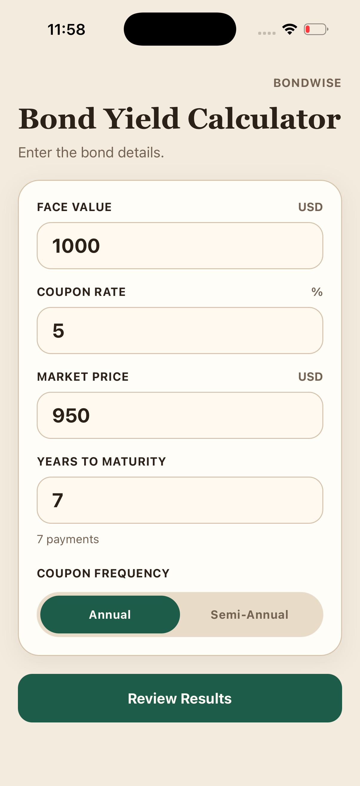
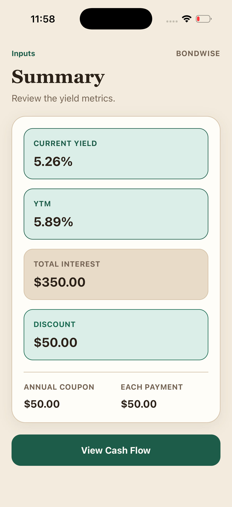
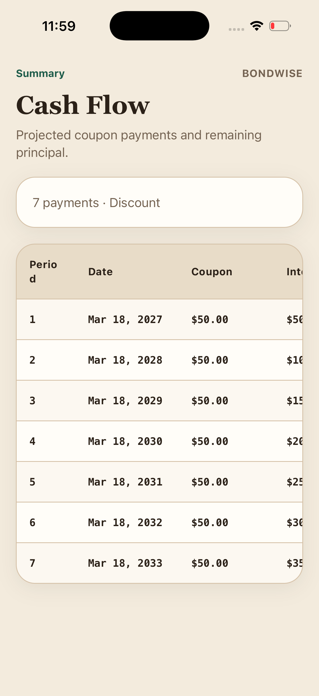
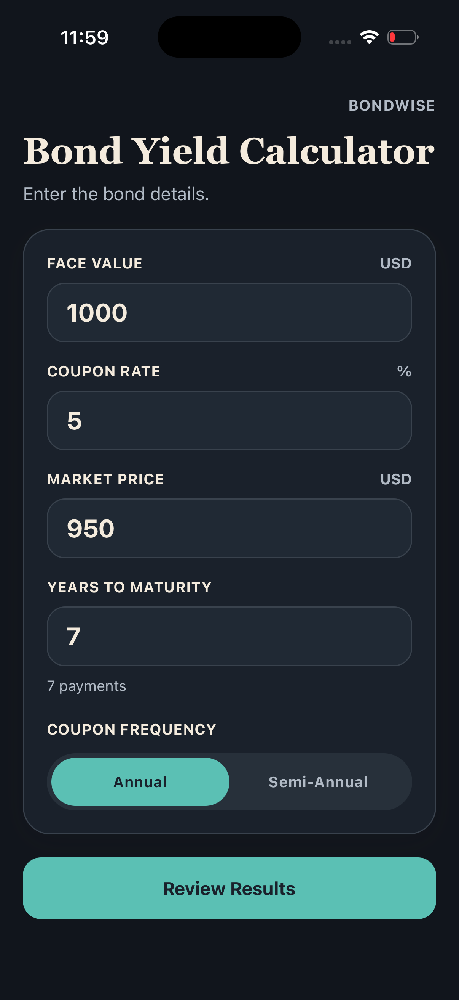
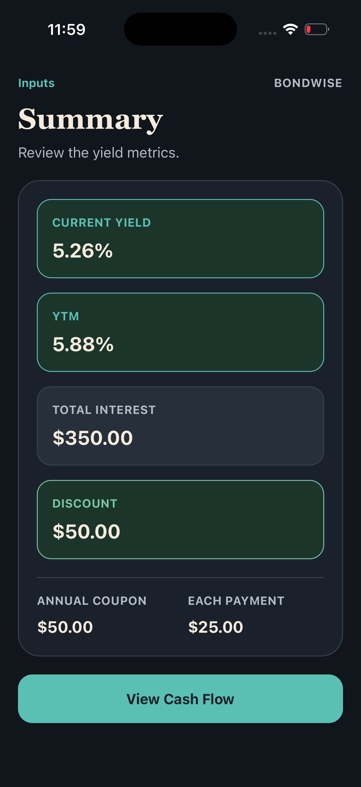
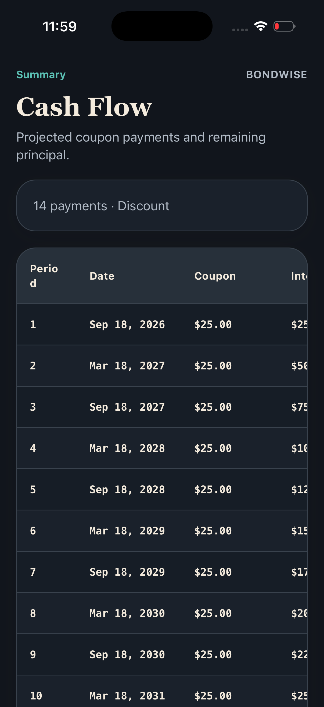

# BondWise

BondWise is a React Native + TypeScript app for bond yield analysis.

The UI is intentionally split into a simple flow:

1. Inputs
2. Summary
3. Cash Flow

That makes the app easier to understand for new users and easier to change live in an interview.

## Screenshots

| Inputs                                            | Summary                                               | Cash Flow                                                |
| ------------------------------------------------- | ----------------------------------------------------- | -------------------------------------------------------- |
|  |  |  |
|    |    |    |

## Demo Video

<p align="left">
  
</p>

## Features

- Face value, coupon rate, market price, years to maturity, and coupon frequency inputs
- Current yield, YTM, total interest, and premium/discount summary
- Separate cash flow screen with payment schedule
- Cash flow table columns: Period, Payment Date, Coupon Payment, Cumulative Interest, Remaining Principal
- Light and dark theme support
- Safe validation while typing so empty or partial values do not crash the app

## Structure

- `src/domain/bond.ts`
  - Bond math, validation, YTM solver, schedule generation
- `src/navigation/AppNavigator.tsx`
  - Lightweight app navigation: `Inputs -> Summary -> Cash Flow`
- `src/features/bond-calculator/`
  - Feature-level modules for the bond calculator UI
- `src/screens/`
  - Screen composition for each step in the flow
- `src/components/`
  - Reusable shared UI primitives
- `src/design/`
  - Tokens and runtime theme support

Each main folder now has an `index.ts` so imports can stay shallow.

## Import Aliases

- `@theme`
- `@domain`
- `@components`
- `@features/*`
- `@navigation`
- `@screens`
- `@lib`
- `@designsystem` and `@designsytem`

## Run

```sh
yarn start
yarn android
```

For iOS:

```sh
bundle install
bundle exec pod install
yarn ios
```

## Verify

```sh
yarn --ignore-engines lint
yarn --ignore-engines test --watch=false --watchman=false
yarn --ignore-engines test:coverage
```

Coverage HTML report:

- `coverage/lcov-report/index.html`

## Commit Plan

These are the commits I would use so the history stays interview-friendly:

1. `feat: add validated bond domain model and cash flow logic`
2. `feat: add theme system with light and dark palettes`
3. `feat: build reusable calculator UI primitives`
4. `feat: split calculator into input summary and cash flow screens`
5. `test: cover app render and calculator behavior`
6. `docs: document app flow and local setup`

## Interview Walkthrough

Start here:

1. `src/domain/bond.ts`
2. `src/navigation/AppNavigator.tsx`
3. `src/features/bond-calculator/`
4. `src/screens/BondFormScreen.tsx`
5. `src/screens/BondSummaryScreen.tsx`
6. `src/screens/BondScheduleScreen.tsx`

## Delivery

- Push the branch to GitHub
- Record a short demo showing:
  - entering inputs
  - moving to the summary screen
  - opening the cash flow screen
  - changing coupon frequency live
- Include both light-theme and dark-theme app states in the demo or README screenshots
